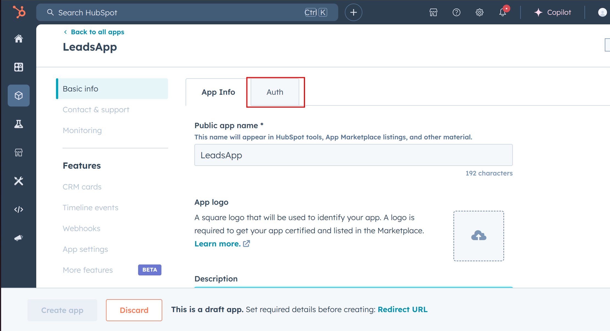
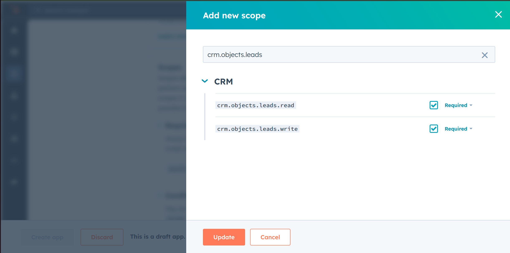
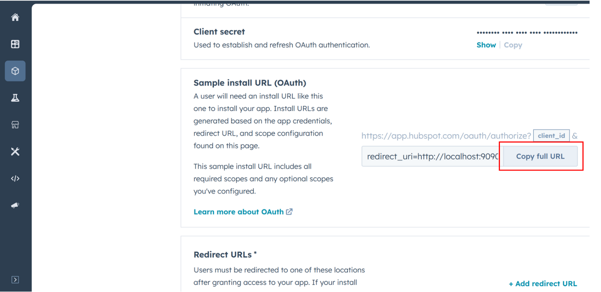

## Overview

"[HubSpot](https://www.hubspot.com/our-story) is an AI-powered customer relationship management (CRM) platform.

The ballerinax/hubspot.crm.obj.leads offers APIs to connect and interact with the [HubSpot API for CRM Leads](https://developers.hubspot.com/docs/reference/api/crm/objects/leads) endpoints, specifically based on the [HubSpot CRM Leads API v3 OpenAPI spec](https://github.com/HubSpot/HubSpot-public-api-spec-collection/blob/main/PublicApiSpecs/CRM/Leads/Rollouts/424/v3/leads.json)"

>**_NOTE:_**             
This package may be changed in the future based on the HubSpot API changes, since it is currently under development and is subject to change based on testing and feedback. By using this package, you are agreeing to accept any future changes that might occur and understand the risk associated with testing an unstable API.
Refer to the [HubSpot Developer Terms](https://legal.hubspot.com/developer-terms?_gl=1*fmuxuh*_ga*NDU4NDIxOTA5LjE3MzQ3ODM3Mjg.*_ga_LXTM6CQ0XK*MTczNDgwNjI1OS4yLjAuMTczNDgwNjI1OS42MC4wLjA.&_ga=2.66923502.174841559.1734639641-983296813.1734639641) & [Developer Beta Terms](https://legal.hubspot.com/developerbetaterms?_gl=1*fmuxuh*_ga*NDU4NDIxOTA5LjE3MzQ3ODM3Mjg.*_ga_LXTM6CQ0XK*MTczNDgwNjI1OS4yLjAuMTczNDgwNjI1OS42MC4wLjA.&_ga=2.66923502.174841559.1734639641-983296813.1734639641) for more information.

## Setup guide

To use the HubSpot Marketing Events connector, you must have access to the HubSpot API through a HubSpot developer account and a HubSpot App under it. Therefore you need to register for a developer account at HubSpot if you don't have one already.

### Step 1: Create/Login to a HubSpot Developer Account

If you have an account already, go to the [HubSpot developer portal](https://app.hubspot.com/)

If you don't have a HubSpot Developer Account you can sign up to a free account [here](https://developers.hubspot.com/get-started)

### Step 2 (Optional): Create a [Developer Test Account](https://developers.hubspot.com/beta-docs/getting-started/account-types#developer-test-accounts) under your account

Within app developer accounts, you can create developer test accounts to test apps and integrations without affecting any real HubSpot data.

> **Note:** These accounts are only for development and testing purposes. In production you should not use Developer Test Accounts.

1. Go to Test Account section from the left sidebar.

   

2. Click Create developer test account.

   

3. In the dialogue box, give a name to your test account and click create.

   

### Step 3: Create a HubSpot App under your account.

1. In your developer account, navigate to the "Apps" section. Click on "Create App"

   

2. Provide the necessary details, including the app name and description.

### Step 4: Configure the Authentication Flow.

1. Move to the Auth Tab.

   

2. In the Scopes section, add the following scopes for your app using the "Add new scope" button.

   `crm.objects.leads.read`

   `crm.objects.leads.write`

   

4. Add your Redirect URI in the relevant section. You can also use localhost addresses for local development purposes. Click Create App.

   

### Step 5: Get your Client ID and Client Secret

- Navigate to the Auth section of your app. Make sure to save the provided Client ID and Client Secret.

   

### Step 6: Setup Authentication Flow

Before proceeding with the Quickstart, ensure you have obtained the Access Token using the following steps:

1. Create an authorization URL using the following format:

   ```
   https://app.hubspot.com/oauth/authorize?client_id=<YOUR_CLIENT_ID>&scope=<YOUR_SCOPES>&redirect_uri=<YOUR_REDIRECT_URI>
   ```

    Alternatively the link can be obtained from Hubspot.

    

2. Paste it in the browser and select your developer test account to intall the app when prompted.

   

3. A code will be displayed in the browser. Copy the code.


4. Run the following curl command. Replace the `<YOUR_CLIENT_ID>`, `<YOUR_REDIRECT_URI>` and `<YOUR_CLIENT_SECRET>` with your specific value. Use the code you received in the above step 3 as the `<CODE>`.

   - Linux/macOS

     ```bash
     curl --request POST \
     --url https://api.hubapi.com/oauth/v1/token \
     --header 'content-type: application/x-www-form-urlencoded' \
     --data 'grant_type=authorization_code&code=<CODE>&redirect_uri=<YOUR_REDIRECT_URI>&client_id=<YOUR_CLIENT_ID>&client_secret=<YOUR_CLIENT_SECRET>'
     ```

   - Windows

     ```bash
     curl --request POST ^
     --url https://api.hubapi.com/oauth/v1/token ^
     --header 'content-type: application/x-www-form-urlencoded' ^
     --data 'grant_type=authorization_code&code=<CODE>&redirect_uri=<YOUR_REDIRECT_URI>&client_id=<YOUR_CLIENT_ID>&client_secret=<YOUR_CLIENT_SECRET>'
     ```

   This command will return the access token necessary for API calls.

   ```json
   {
     "token_type": "bearer",
     "refresh_token": "<Refresh Token>",
     "access_token": "<Access Token>",
     "expires_in": 1800
   }
   ```

5. Store the access token securely for use in your application.

## Quickstart

To use the `HubSpot CRM Leads Connector` in your Ballerina application, update the `.bal` file as follows:

### Step 1: Import the module

Import the `hubspot.crm.objects.leads` module and `oauth2` module.

```ballerina
import ballerinax/hubspot.crm.objects.leads as hsleads;
import ballerina/oauth2;
```

### Step 2: Instantiate a new connector

1. Create a `Config.toml` file and, configure the obtained credentials in the above steps as follows:

   ```toml
    clientId = "<Client Id>"
    clientSecret = "<Client Secret>"
    refreshToken = "<Refresh Token>"
   ```

2. Instantiate a `hsleads:ConnectionConfig` with the obtained credentials and initialize the connector with it.

    ```ballerina 
    configurable string clientId = ?;
    configurable string clientSecret = ?;
    configurable string refreshToken = ?;

    final hsleads:ConnectionConfig hsleadsConfig = {
        auth : {
            clientId,
            clientSecret,
            refreshToken,
            credentialBearer: oauth2:POST_BODY_BEARER
        }
    };

    final hsleads:Client hsleads = check new (hsleadsConfig);
    ```

### Step 3: Invoke the connector operation

Now, utilize the available connector operations. A sample usecase is shown below.

#### Create a Lead
    
```ballerina
public function main() returns error? {
   SimplePublicObjectInputForCreate payload = {
      {
         "associations": [
            {
               "types": [
                  {
                     "associationCategory": "HUBSPOT_DEFINED",
                     "associationTypeId":578
                  }
               ],
               "to": {
                  "id": "YOUR_CONTACT_ID"
               }
            }
         ],
         "properties": {
            "hs_lead_name": "John Doe"
         }
      }
   }
   hsleads:SimplePublicObject createLead = check hsleads->/.post(payload);
}
```

### Step 4: Run the Ballerina application

```bash
bal run
```

## Examples

The `Ballerina HubSpot CRM Leads Connector` connector provides practical examples illustrating usage in various scenarios. Explore these [examples](https://github.com/module-ballerinax-hubspot.crm.object.leads/tree/main/examples/real_estate_inquiry_leads/main.bal/), covering the following use cases:

- [Real Estate Inquiry Leads](https://github.com/anush47/module-ballerinax-hubspot.crm.object.leads/blob/main/examples/real_estate_inquiry_leads)
- [Fitness Center Leads](https://github.com/anush47/module-ballerinax-hubspot.crm.object.leads/blob/main/examples/fitness_center_leads)